# Data Cleaning Script

This folder contains the data cleaning and analysis script.

## Structure

```
AIA/
├── data/                    # Original raw data files
├── cleared_data/            # Cleaned CSV files (created when script runs)
│   ├── teams_processed.csv
│   ├── standings_processed.csv
│   ├── scorers_processed.csv
│   ├── matches_processed.csv
│   ├── team_statistics_aggregated.csv
│   ├── top_scorers_aggregated.csv
│   ├── team_match_statistics_aggregated.csv
│   ├── goals_per_matchday_aggregated.csv
│   └── plots/
│       └── (8 visualization PNG files)
└── data_cleaning/           # This folder
    └── cleaning_code.py     # Main cleaning script
```

## How to Run

1. Make sure you have the required dependencies installed:
   ```bash
   pip install -r ../requirements.txt
   ```

2. Run the script from the root directory:
   ```bash
   cd data_cleaning
   python cleaning_code.py
   ```

   Or from the root directory:
   ```bash
   python data_cleaning/cleaning_code.py
   ```

## What It Does

1. **Cleans 4 CSV files** from `../data/`:
   - `teams.csv` → `cleared_data/teams_processed.csv`
   - `standings.csv` → `cleared_data/standings_processed.csv`
   - `scorers.csv` → `cleared_data/scorers_processed.csv`
   - `matches.csv` → `cleared_data/matches_processed.csv`

2. **Handles missing values**:
   - Numeric columns: filled with 0
   - Text columns: filled with 'Unknown'

3. **Removes unnecessary columns**:
   - All raw JSON columns are dropped

4. **Creates 4 aggregated datasets**:
   - Team statistics summary
   - Top scorers by season
   - Team match statistics (home/away splits)
   - Goals per matchday analysis

5. **Generates 12 visualizations** saved to `cleared_data/plots/`:
   
   **Regular Plots:**
   - [Top teams by points](#1-top_teams_by_pointspng)
   - [Goals for vs goals against](#2-goals_for_vs_againstpng)
   - [Top scorers](#3-top_scorerspng)
   - [Goals vs assists](#4-goals_vs_assistspng)
   - [Win-draw-loss distribution](#5-win_draw_loss_distributionpng)
   - [Goals per matchday](#6-goals_per_matchdaypng)
   - [Team performance heatmap](#7-team_performance_heatmappng)
   - [Goal difference distribution](#8-goal_difference_distributionpng)
   
   **Boxplots:**
   - [Team performance metrics distribution](#9-team-performance-metrics-distribution-boxplot)
   - [Goals by league position](#10-goals-by-league-position-boxplot)
   - [Player goals and assists distribution](#11-player-goals-and-assists-distribution-boxplot)
   - [Home vs away goals distribution](#12-home-vs-away-goals-distribution-boxplot)

## Output Location

All cleaned files and visualizations are saved to `../cleared_data/` (same level as the `data/` folder).

---

## Detailed Plot Explanations

### 1. **top_teams_by_points.png**

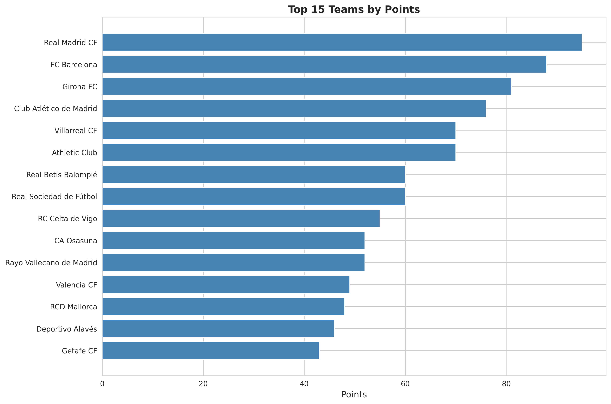

**What it shows:** A horizontal bar chart displaying the top 15 teams ranked by their total points.

**Data processing:**
- Data source: `standings_processed.csv`
- Aggregation: Groups by `team_name` and takes the maximum `points` for each team (handles multiple seasons/records)
- Sorting: Teams sorted by points in descending order
- Display: Top 15 teams shown horizontally for easy reading

**Meaning:** This visualization identifies the most successful teams based on league points accumulated. Higher points indicate better league performance across seasons.

---

### 2. **goals_for_vs_against.png**

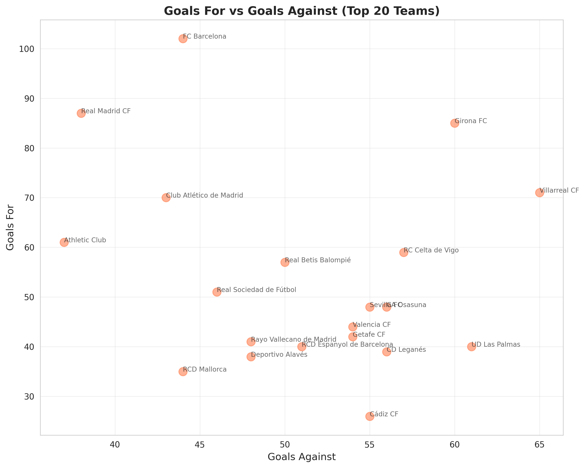

**What it shows:** A scatter plot comparing offensive (goals for) vs defensive (goals against) performance for the top 20 teams.

**Data processing:**
- Data source: `standings_processed.csv`
- Aggregation: Uses maximum `goalsFor` and `goalsAgainst` per team
- Selection: Top 20 teams by points
- Visualization: Each team plotted as a point with annotations

**Meaning:** 
- Teams in the **upper left** (high goals for, low goals against) are strong offensively and defensively
- Teams in the **upper right** (high goals for, high goals against) are attacking but weak defensively
- Teams in the **lower left** (low goals for, low goals against) are defensive but weak offensively
- Teams in the **lower right** (low goals for, high goals against) are struggling overall

---

### 3. **top_scorers.png**

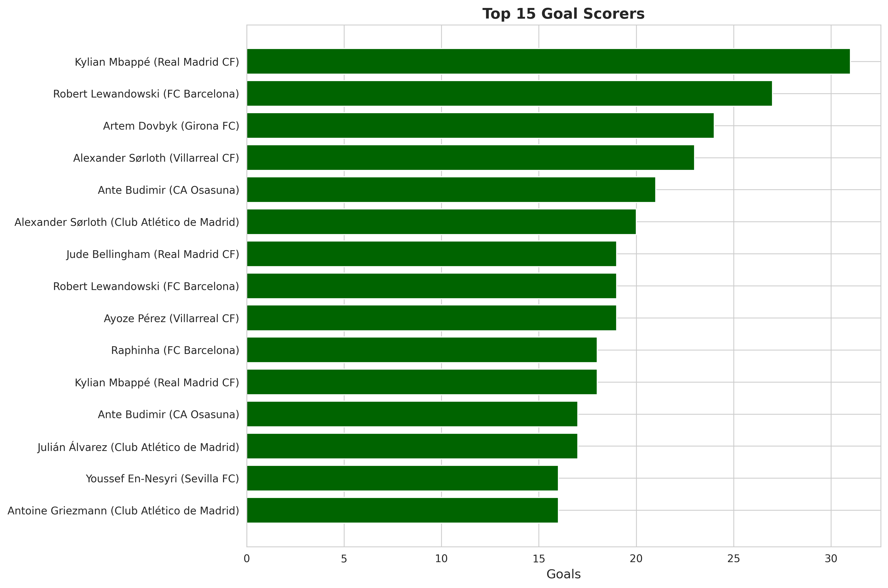

**What it shows:** A horizontal bar chart of the top 15 individual goal scorers with their team names.

**Data processing:**
- Data source: `scorers_processed.csv`
- Cleaning: Removed JSON columns, handled missing values (0 for missing goals is valid - a player might have 0 goals)
- Aggregation: Uses individual player records sorted by total `goals`
- Display: Shows player name and their team

**Meaning:** Identifies the most prolific goal scorers in the dataset. Useful for analyzing individual player performance and identifying star players across teams.

---

### 4. **goals_vs_assists.png**

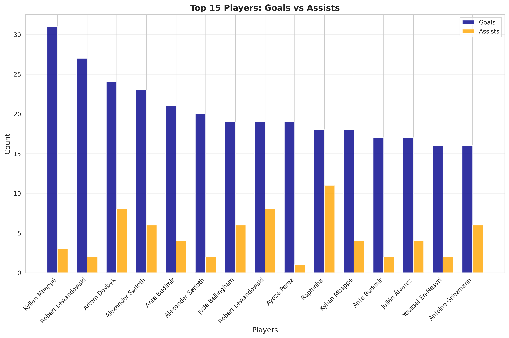

**What it shows:** A grouped bar chart comparing goals and assists for the top 15 goal scorers.

**Data processing:**
- Data source: `scorers_processed.csv`
- Selection: Top 15 players by goals
- Visualization: Side-by-side bars for goals (dark blue) and assists (orange) for each player
- Both metrics shown on same chart for direct comparison

**Meaning:** 
- Identifies **complete players** who both score and create goals (high in both metrics)
- Shows **pure scorers** (high goals, low assists) vs **playmakers** (moderate goals, high assists)
- Helps understand player roles and playing styles

---

### 5. **win_draw_loss_distribution.png**


**What it shows:** A grouped bar chart showing the breakdown of wins, draws, and losses for the top 10 teams.

**Data processing:**
- Data source: `standings_processed.csv`
- Aggregation: Groups by `team_name`, takes maximum values for `won`, `draw`, `lost` columns
- Selection: Top 10 teams by points
- Visualization: Three bars per team (green for wins, gray for draws, red for losses)

**Meaning:**
- Shows team consistency and playing style
- Teams with many wins and few losses are dominant
- Teams with many draws may be more defensive
- Total of wins + draws + losses should equal games played

---

### 6. **goals_per_matchday.png**

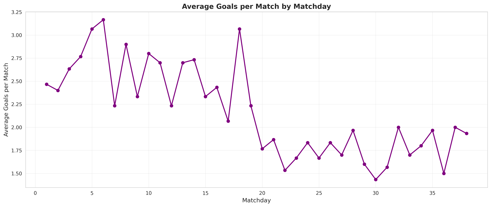

**What it shows:** A line chart tracking the average number of goals per match across different matchdays in the season.

**Data processing:**
- Data source: `matches_processed.csv`
- Aggregation: Groups by `matchday`, sums `score_fullTime_home` and `score_fullTime_away`, counts matches
- Calculation: `avg_goals_per_match = total_goals / matches_count`
- Filtering: Only includes valid matchdays (> 0)
- Visualization: Line plot with markers showing trend over season

**Meaning:**
- Identifies **seasonal patterns** - do teams score more at the beginning or end of season?
- Shows **competitiveness** - more goals might indicate less defensive play
- Can reveal **matchday effects** - certain weeks might have more/less exciting matches

---

### 7. **team_performance_heatmap.png**

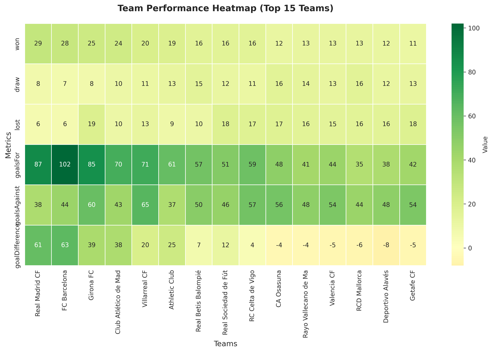

**What it shows:** A color-coded heatmap showing multiple performance metrics across the top 15 teams.

**Data processing:**
- Data source: `standings_processed.csv`
- Metrics included: `won`, `draw`, `lost`, `goalsFor`, `goalsAgainst`, `goalDifference`
- Aggregation: Maximum values per team for each metric
- Selection: Top 15 teams by points
- Visualization: Heatmap with color intensity indicating metric values (red-yellow-green scale)

**Meaning:**
- **Quick visual comparison** of multiple performance dimensions
- Teams with **green across all metrics** are top performers
- **Red in wins/goalsFor** but **green in goalsAgainst** suggests defensive teams
- Allows **pattern recognition** across teams and metrics simultaneously

---

### 8. **goal_difference_distribution.png**

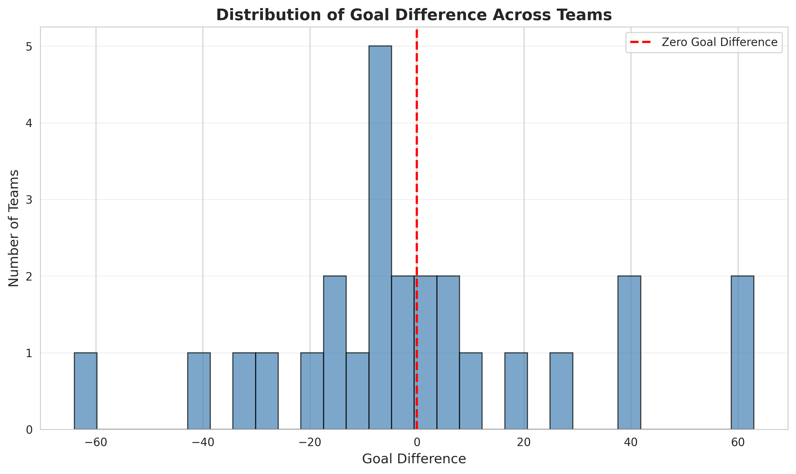

**What it shows:** A histogram showing the distribution of goal differences across all teams.

**Data processing:**
- Data source: `standings_processed.csv`
- Aggregation: Groups by `team_name`, takes maximum `goalDifference` per team
- Calculation: Goal difference = Goals For - Goals Against
- Visualization: Histogram with 30 bins, red vertical line at 0

**Meaning:**
- Shows **league competitiveness**:
  - If distribution is spread wide = varied team quality (some very good, some very poor)
  - If distribution is narrow = competitive league (teams are closer in quality)
- **Zero line** separates positive (scoring more than conceding) vs negative (conceding more than scoring)
- Positive goal difference teams are typically in upper half of table

---

## Data Cleaning Notes

---

### 9. **Team Performance Metrics Distribution (Boxplot)**

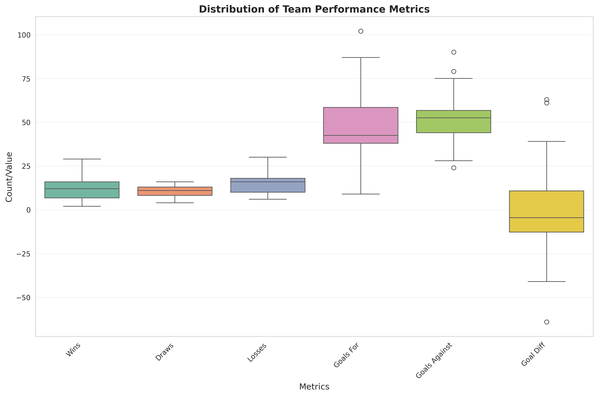

**What it shows:** A boxplot comparing the distributions of different team performance metrics: wins, draws, losses, goals for, goals against, and goal difference.

**Data processing:**
- Data source: `standings_processed.csv` aggregated to `team_stats`
- Metrics: Extracts `won`, `draw`, `lost`, `goalsFor`, `goalsAgainst`, `goalDifference`
- Visualization: Multiple boxplots side-by-side for comparison

**Meaning:**
- Shows **median** (middle line), **quartiles** (box edges), and **outliers** (dots) for each metric
- **Wide boxes** = high variance (teams perform very differently)
- **Narrow boxes** = low variance (teams are similar)
- **Outliers** = exceptional teams (very high or very low performance)
- Helps identify which metrics show most variation across teams

---

### 10. **Goals by League Position (Boxplot)**

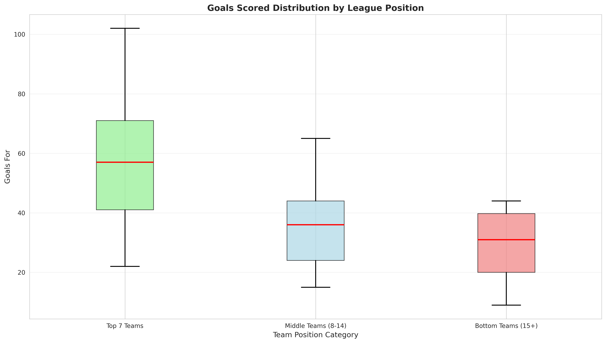

**What it shows:** Boxplots comparing goals scored distribution across teams grouped by their league position (top, middle, bottom).

**Data processing:**
- Data source: `standings_processed.csv`
- Grouping: Teams split into three groups:
  - Top 7 teams (positions 1-7)
  - Middle teams (positions 8-14)
  - Bottom teams (position 15+)
- Metric: `goalsFor` (goals scored)
- Visualization: Separate boxplot for each position group

**Meaning:**
- Reveals if **top teams score significantly more** than lower teams
- Shows **overlap** between groups (is there a clear separation?)
- **Higher median** for top teams indicates better offensive performance
- If boxes overlap, it suggests some bottom teams can score well but may have weak defense

---

### 11. **Player Goals and Assists Distribution (Boxplot)**

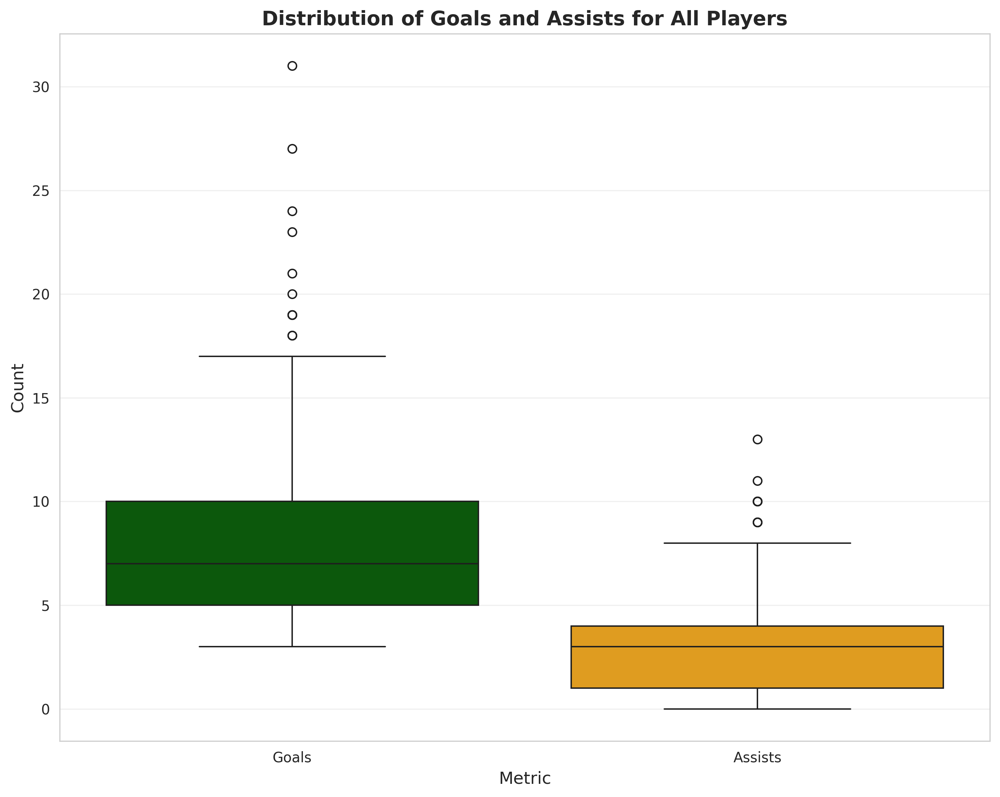

**What it shows:** Boxplots comparing the distribution of goals and assists across all players in the dataset.

**Data processing:**
- Data source: `scorers_processed.csv`
- Metrics: `goals` and `assists` columns
- Visualization: Side-by-side boxplots for comparison

**Meaning:**
- Shows the **typical range** of goals and assists for players
- **Median** shows the "average player" performance
- **Outliers** represent exceptional players (high scorers/playmakers)
- If goals box is higher than assists, most players score more than they assist
- Helps understand the distribution of talent in the league

---

### 12. **Home vs Away Goals Distribution (Boxplot)**

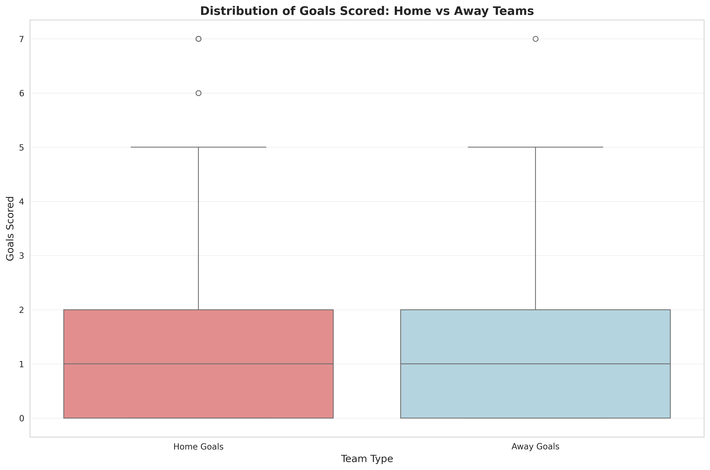

**What it shows:** Boxplots comparing the distribution of goals scored by home teams vs away teams.

**Data processing:**
- Data source: `matches_processed.csv`
- Extraction: `score_fullTime_home` and `score_fullTime_away` columns
- Filtering: Removes any NaN values
- Visualization: Two boxplots side-by-side

**Meaning:**
- Tests the **home advantage hypothesis** - do home teams score more?
- **Higher median** for home teams = home advantage exists
- **Overlapping boxes** = home advantage is minimal
- **Separated boxes** = strong home advantage effect
- Outliers show high-scoring matches (unusual goal totals)

---

## Data Cleaning Notes

**Important:** The script preserves legitimate zero values (0 goals, 0-0 scores, etc.). The `fillna(0)` method only fills **actual missing/NaN values**, not existing zeros. This ensures all valid football statistics are maintained accurately.

